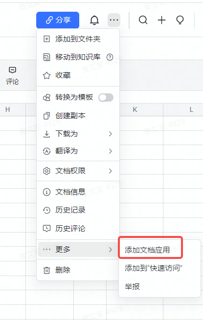
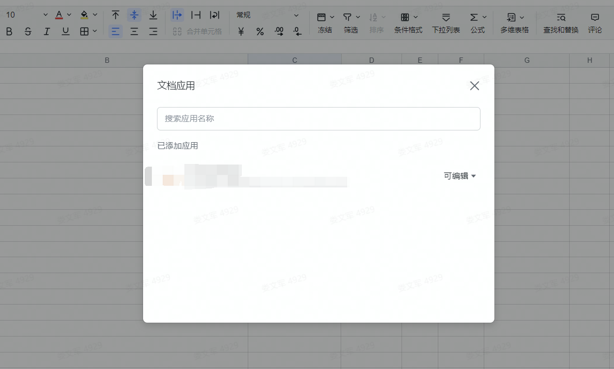

# 打通飞书表格与TAPD数据关联和同步
## 目的
对许多企业来说，如何有效地进行项目管理是一个急需解决的问题。工欲善其事，必先利其器——优秀的项目管理工具能够让企业事半功倍；为了能够基于飞书表格功能和特性可以与tapd数据进行关联，对需求和缺陷任务进行快速、方便的管理。

## 功能说明
- 支持飞书表格字段自动会与TAPD单的字段进行匹配，对其自动更新或创建
- 支持飞书向TAPD同步
- 支持TAPD向飞书表格ID一致的数据进行更新
- 支持字段列的动态移动，不需要绑定字段固定位置，也可以对该字段数据进行更新
- 支持数据同步成功或失败信息显示日志字段

## 前期准备
### 飞书
- 创建自建应用； 地址:https://open.feishu.cn/app
- 创建一个应用
2. 给应用添加表格读写权限
3. 发布应用
4. 获取应用凭证
5. 在飞书表格进行添加应用






### TAPD

- 获取请求认证
- 项目权限

### 环境
Python3 +
```
pip install -r requirements.txt
```
## 执行
```
python main.py [TAPD项目ID] [飞书表格URL] [任务类型:bugs|stories] [同步目标:fs|tapd]
```
### 示例：
- 将飞书的数据向tapd同步，ID列如果没有则创建，有的话则更新
```
python3 main.py 11111 https://huanle.feishu.cn/sheets/shtcnxxxxxxxxxx?sheet=xxxx bug tapd
```

- 飞书表格数据执行前


- 飞书表格数据执行后


- 通过ID连接可以直接跳转对应任务详情页


